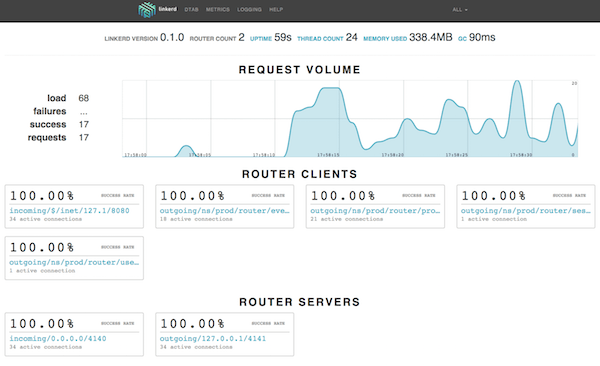

# LINKERD：用于微服务的TWITTER风格可操作性

> 原文: [LINKERD: TWITTER-STYLE OPERABILITY FOR MICROSERVICES][]
>
> 作者: [WILLIAM MORGAN][], 时间: 2016-02-18

您如何大规模运维现代云原生应用程序？在实践中出现什么问题，而他们是如何被处理？ 在大容量和不可预测的工作负载下,运行基于云原生和微服务的应用程序实际需要什么，而不会对功能版本或产品更改引入摩擦？

对于所有关于微服务的讨论，事实证明，很少有人能够真正回答这些问题。令人兴奋的新技术如Docker，Mesos，Kubernetes和gRPC的迅速崛起，使得我们所有的扶手椅建筑师变得轻松。但真的是高流量，生产用途？据推算，实际解决了微服务器规模化问题的公司数量非常少。

> 译者注: `Armchair Architect` 扶手椅建筑师,详细解释见 http://wiki.c2.com/?ArmchairArchitect

Twitter是这些公司之一。虽然它肯定有公共中断的份额(share of public outages)，但它运行着 [世界上最高规模的微服务应用程序][] 之一，其中包括数百个服务，数万个节点和每个服务数百万个的RPS。令人震惊的是，事实证明这 [并不容易][]。出现的问题 [并不明显][]。故障模式 [令人惊讶][]，[难于预测][]，有时甚至 [难以形容][]。可以做到这一点，但是要在实践中做好这一切，需要 [多年的思考和工作][]。

当 Oliver 和我在不是很久的时候离开Twitter，我们的目标是吸取这些年的运维知识，并把它们变成世界其他地方可以使用的东西。令人高兴的是，大量的知识已经在一个名为 [Finagle][] 的开源项目中编码，Finagle是高效的RPC库，为Twitter的微服务架构提供支持。

Finagle是Twitter的核心库，用于管理服务之间的沟通。实际上，Twitter上的每一个在线服务都建立在Finagle的基础之上，每秒可以为数百万的RPC调用服务。并且并非只有Twitter - Finagle也支持了Pinterest，SoundCloud, Strava，StumbleUpon等众多公司的基础设施。

今天，我们很高兴地宣布我们在将Finagle用于群众的愿景中迈出一小步。linkerd 已经达到了 0.1.0，而我们在Apache License v2下开源了它。

linkerd  是我们用于云原生应用程序的开源服务网格。它直接在Finagle上构建，旨在为您提供Twitter的基于微服务的编排架构的所有运营优势 - 多年来所学到的许多经验教训 - 以独立的方式，具有最小的依赖性，并且可以只做最小的变化就用于现有的应用程序。

如果你正在构建一个微服务并希望从Finagle的好处中受益，包括 [智能自适应负载均衡][]，在 [服务发现抽象][] 和  [内部服务流量路由][] - 你可以使用linkerd来添加这些功能，而无需改变你的应用代码. 另外，华丽的仪表板！

linkerd尚未完成，但本着“早日发布和经常发布”的精神，我们认为现在是让这个孩子出来玩的时候了。

因此，如果这引起了你的兴趣，那么请从 linksd.io 开始进行文档和下载。如果您有兴趣参与，请直接访问 [linkerd github repo][]。我们是开放源码的坚强信徒 - 从几乎一开始，Finagle本身就是开源的，而我们很高兴为此建立一个社区。

在我们之前有一个漫长的路线图，还有一大堆我们期待添加到likerd的令人兴奋的功能。快来加入我们的行列！

- [William][], [Oliver][], 和 [Buoyant的整个团队][]。

（如果您想知道名称：我们喜欢将linkerd视为云原生应用程序的“dynamic linker/动态链接器”，就像操作系统中的动态链接器一行,通过库和函数的名称，并做调用函数必须的工作，因此，linkerd也可以使用服务和端点的名称，并且进行必要的工作使调用安全，而可靠地进行。有关该模型的更多信息，请参阅 [Marius在FinagleCon上的讲话][]。）

[LINKERD: TWITTER-STYLE OPERABILITY FOR MICROSERVICES]:https://buoyant.io/2016/02/18/linkerd-twitter-style-operability-for-microservices/
[WILLIAM MORGAN]:https://buoyant.io/author/william/
[世界上最高规模的微服务应用程序]:https://blog.twitter.com/2013/new-tweets-per-second-record-and-how
[并不容易]:http://www.slideshare.net/InfoQ/decomposing-twitter-adventures-in-serviceoriented-architecture
[并不明显]:https://www.somethingsimilar.com/2013/01/14/notes-on-distributed-systems-for-young-bloods/
[令人惊讶]:http://roc.cs.berkeley.edu/papers/dsconfig.pdf
[难于预测]:http://web.archive.org/web/20141009231131/http://www.ctlab.org/documents/How%20Complex%20Systems%20Fail.pdf
[难以形容]:https://blog.twitter.com/2012/today-s-turbulence-explained
[多年的思考和工作]:http://monkey.org/~marius/redux.html
[Finagle]:http://finagle.github.io/
[智能自适应负载均衡]:../doc/features/load-balancing.md
[服务发现抽象]:../doc/features/service-discovery.md
[内部服务流量路由]:../doc/features/routing.md
[linkerd github repo]:https://github.com/linkerd/linkerd
[William]:https://twitter.com/wm
[Oliver]:https://twitter.com/olix0r
[Buoyant的整个团队]:https://buoyant.io/
[Marius在FinagleCon上的讲话]:http://monkey.org/~marius/redux.html
