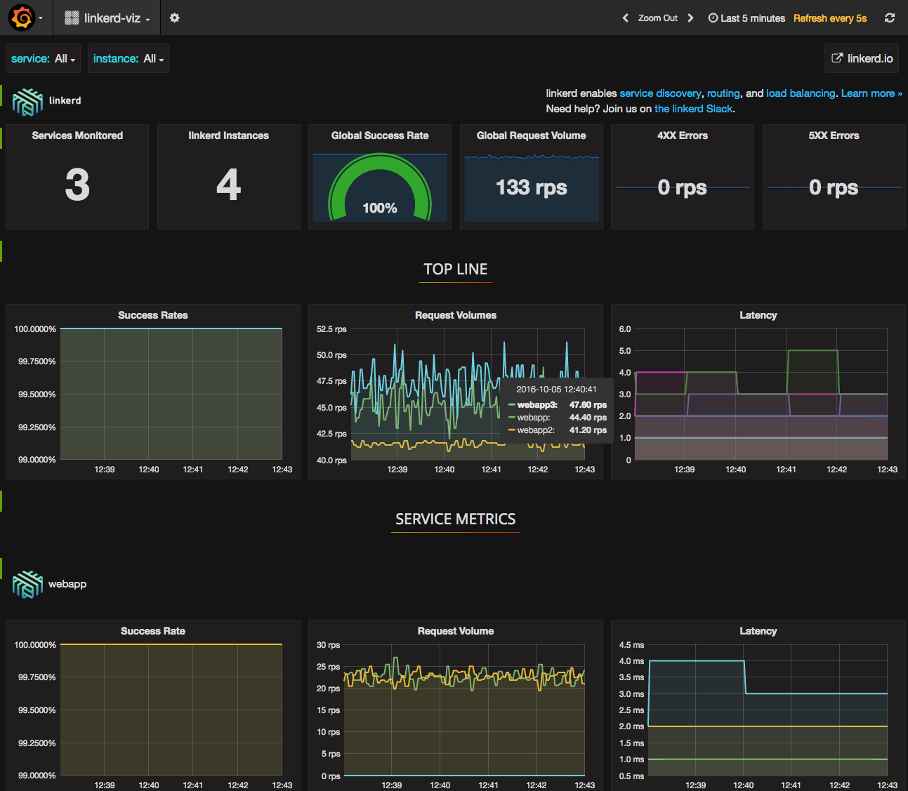

# 在DC/OS中运行

本指南将引导您完成在 DC/OS 中运行linkerd，将请求路由到示例Web服务,并监控集群。

## 部署webapp

我们将部署一个响应“Hello world”的示例应用程序。我们将使用来自 [linkerd-examples][] 仓库的 [webapp.json][] 配置文件：

```bash
dcos marathon app add https://raw.githubusercontent.com/linkerd/linkerd-examples/master/dcos/webapp.json
```

## 部署linkerd

使用以下命令安装 linkerd DC/OS Universe 软件包，注意 `instances` 应与 DC/OS 集群中的节点总数相匹配,包括公共和私有：

```bash
$ dcos package install --options=<(echo '{"linkerd":{"instances":4}}') linkerd
```

请注意，linkerd 引导两个服务器，在端口`4140`上`传出`，并在`4141`上`传入`。您的应用程序对端口4140上的本地linkerd发出传出请求，linkerd将请求路由到在远程节点端口4141上的运行的单独的linkerd。远程节点上的linkerd接受传入请求并将其路由到本地应用程序实例。

```bash
$ http_proxy=$PUBLIC_NODE:4140 curl -s http://webapp/hello
Hello world
```

最后，要访问管理服务，请在端口 `9990` 上发出请求：

```bash
$ curl $PUBLIC_NODE:9990/admin/ping
pong
```

## 应用组

对于作为组的一部分部署的应用程序，将组/应用程序名称反转到域中。例如，`my-group/webapp` 成为 `webapp.my-group`：

```bash
$ http_proxy=$PUBLIC_NODE:4140 curl webapp.my-group/hello
Hello world
```

## 部署自定义的linkerd

您还可以安装自己的自定义版本的linkerd，例如：

```bash
dcos marathon app add https://raw.githubusercontent.com/linkerd/linkerd-examples/master/dcos/linker-to-linker/linkerd-dcos.json
```

此自定义版本在其命令中嵌入了一个linkerd配置文件，作为字符串编码的json，更可读的版本是 [linkerd-examples][] 仓库中的 [linkerd-config.yml][]。

要修改linkerd配置，请执行以下操作：

1. 编辑 `linkerd-config.yml`
2. 使用类似 [http://json2yaml.com][json2yaml] 的东西转换为JSON
3. 删除所有换行符和转义引号：

    ```bash
    cat linkerd-config.json |tr -d '\n '|sed 's/"/\\\\\\\"/g'
    ```

4. 用输出内容替换 `linkerd-dcos.json` 中 `cmd` 字段的内容。

## 部署linkerd-viz

linkerd-viz 是监控程序,用于通过linkerd进行路由的应用。部署为 DC/OS Universe 软件包：

```bash
dcos package install linkerd-viz
```

查看dashboard:

```bash
open $(dcos config show core.dcos_url)/service/linkerd-viz
```

或者，安装自定义版本：

```bash
dcos marathon app add https://raw.githubusercontent.com/linkerd/linkerd-viz/master/dcos/linkerd-viz.json
open $PUBLIC_NODE:3000
```


> Linerd Viz

就这样！ 您现在有一个动态路由和监控的 DC/OS 集群。

## linker-to-linker vs. simple-proxy 配置

上面的指南描述了在 linker-to-linker 模式下搭建集群，其中每个linkerd运行传入和传出服务器。这是在 linkerd DC/OS Universe 包中的默认配置，它提供必要的拓扑以支持 linkerd-viz。如果您对更简单的http代理配置感兴趣，请查看 linkerd-examples 库中的 [简单代理][simple-proxy] 示例。

## 进一步阅读

有关配置 linkerd 的更多信息，请参阅 [linkerd配置][] 页面。

有关 linkerd-viz 的更多信息，请参阅 [linkerd-viz GitHub repo][linkerd-viz]。

[linkerd-examples]:https://github.com/linkerd/linkerd-examples
[webapp.json]:https://raw.githubusercontent.com/linkerd/linkerd-examples/master/dcos/webapp.json
[linkerd-config.yml]:https://raw.githubusercontent.com/linkerd/linkerd-examples/master/dcos/linker-to-linker/linkerd-config.yml
[json2yaml]:http://json2yaml.com/
[simple-proxy]:https://github.com/linkerd/linkerd-examples/tree/master/dcos/simple-proxy
[linkerd配置]:https://linkerd.io/config/latest/linkerd
[linkerd-viz]:https://github.com/linkerd/linkerd-viz
