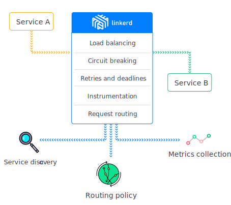
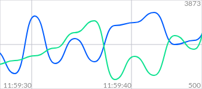
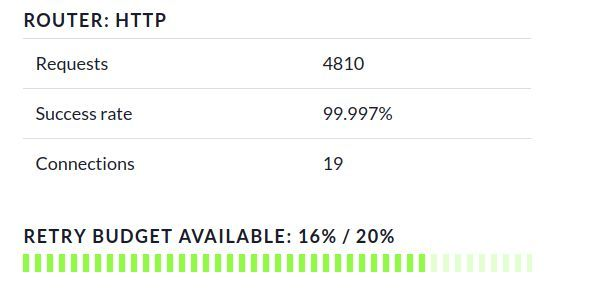
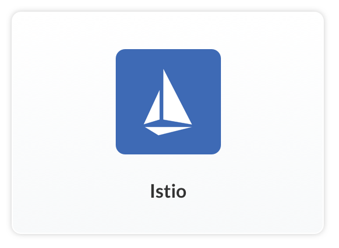

# 介绍

## Linkerd是什么?

Linkerd 是开源网络代理，设计为以服务网格部署：用于管理，控制和监控应用程序内的服务与服务间通讯的专用层。

[阅读更多 »](what-is-linkerd.md)

## Linkerd能做什么?

Linkerd 为您的应用程序增加了可视性，控制和可靠性, 它使用了各式各样的强大技术：熔断，延迟感知负载均衡，最终一致服务发现，截止时间传播以及跟踪和仪器仪表。

## 为什么需要服务网格?

服务交互的方式是应用程序运行时行为的关键部分。没有一致的控制和可见性层，运行时性能可能难以测量和诊断，而部分故障可能传播以至于拖累整个应用程序。

[阅读更多 »](https://buoyant.io/2017/04/25/whats-a-service-mesh-and-why-do-i-need-one/)

此微型仪表板显示对服务的请求，在其两个客户端上进行负载平衡。

> 译者注： 由于 gitbook 无法支持原文的动态图形，所有上图为简单截图，可以浏览 [原页面](https://linkerd.io/overview/) 查看动态图形。

## 开始

在短短几分钟内获取 linkerd 并运行。本节关注在常见环境中运行 linkerd。

请选择一个环境开始：

